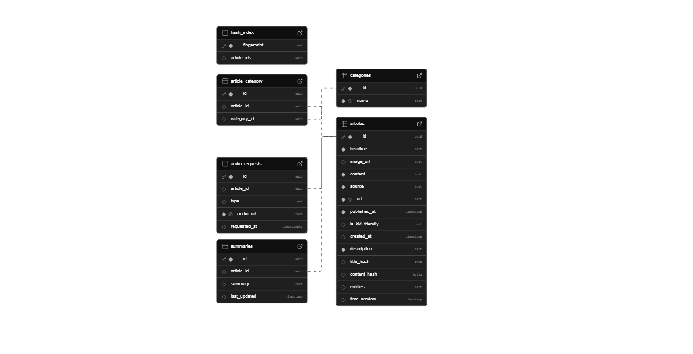

### **Database Schema for the News Website**  
We'll use **PostgreSQL (via Supabase)** and design a **highly optimized, normalized schema** that efficiently stores news articles, summaries, categories, and audio requests. This schema ensures data integrity, scalability, and fast retrieval. Below are the tables and their columns:

---

## **1. `articles` Table (Stores original news articles)**
| Column Name      | Data Type         | Constraints             | Description |
|-----------------|------------------|------------------------|-------------|
| `id`            | UUID (Primary Key) | `PRIMARY KEY`          | Unique identifier for each article |
| `headline`      | TEXT              | `NOT NULL`             | News headline |
| `image_url`     | TEXT              | `NULLABLE`             | URL to the article’s thumbnail/image |
| `content`       | TEXT              | `NOT NULL`             | Full article content |
| `source`        | TEXT              | `NOT NULL`             | News source (e.g., BBC, CNN) |
| `url`           | TEXT              | `UNIQUE NOT NULL`      | Original URL of the news |
| `published_at`  | TIMESTAMP         | `NOT NULL`             | Publication date/time |
| `is_kid_friendly` | BOOLEAN         | `DEFAULT FALSE`        | Indicates if the article is kid-friendly |
| `created_at`    | TIMESTAMP         | `DEFAULT NOW()`        | Timestamp of record creation |
| `description`   | TEXT              | `NULLABLE`             | Short description of the article |
| `title_hash`    | INT               | `NULLABLE`             | Hash value for the title to detect duplicates |
| `content_hash`  | BYTEA             | `NULLABLE`             | Hash value of the content to check for duplicate content |
| `entities`      | TEXT              | `NULLABLE`             | Extracted named entities (e.g., locations, people) |
| `time_window`   | TIMESTAMP         | `NULLABLE`             | Time range associated with the article |

**✨ Key Features:**
- Uses **hashing** to detect duplicate content.
- Stores named entities for **NLP-based insights**.
- Supports **kid-friendly filtering** for age-appropriate content.

---

## **2. `summaries` Table (Stores lazy-generated summaries)**
| Column Name      | Data Type         | Constraints             | Description |
|-----------------|------------------|------------------------|-------------|
| `id`            | UUID (Primary Key) | `PRIMARY KEY`          | Unique identifier |
| `article_id`    | UUID              | `FOREIGN KEY REFERENCES articles(id) ON DELETE CASCADE` | Links to the original article |
| `summary`       | TEXT              | `NULLABLE`             | ML-generated summary (null until first request) |
| `last_updated`  | TIMESTAMP         | `DEFAULT NOW()`        | Last time the summary was updated |

**⚡ Lazy Loading Strategy:**  
- The `summary` column starts as `NULL`.  
- On first request, the summary is generated and stored.  
- Future requests fetch from the database.  
- Ensures efficient use of computational resources.

---

## **3. `categories` Table (Stores available news categories)**
| Column Name | Data Type | Constraints | Description |
|------------|----------|-------------|-------------|
| `id`       | UUID     | `PRIMARY KEY` | Unique category ID |
| `name`     | TEXT     | `UNIQUE NOT NULL` | Category name (e.g., Politics, Sports, Tech) |

**🗂 Why This Table?**
- Standardizes category names to **prevent redundancy**.
- Ensures **consistent classification** of articles.

---

## **4. `article_category` Table (Many-to-Many Relationship)**
| Column Name   | Data Type | Constraints | Description |
|--------------|----------|-------------|-------------|
| `id`         | UUID     | `PRIMARY KEY` | Unique ID for this relation |
| `article_id` | UUID     | `FOREIGN KEY REFERENCES articles(id) ON DELETE CASCADE` | Links to an article |
| `category_id`| UUID     | `FOREIGN KEY REFERENCES categories(id) ON DELETE CASCADE` | Links to a category |

**📌 Why a Join Table?**  
- Articles **can belong to multiple categories** (e.g., "Tech" and "Business").
- Efficient querying using **JOINs**.
- Supports **flexible classification** of content.

---

## **5. `audio_requests` Table (Tracks TTS requests)**
| Column Name    | Data Type | Constraints | Description |
|---------------|----------|-------------|-------------|
| `id`          | UUID     | `PRIMARY KEY` | Unique request ID |
| `article_id`  | UUID     | `FOREIGN KEY REFERENCES articles(id) ON DELETE CASCADE` | Links to an article |
| `type`        | TEXT     | `CHECK (type IN ('full', 'summary'))` | Type of audio request |
| `audio_url`   | TEXT     | `NULLABLE` | URL where the generated audio is stored |
| `requested_at`| TIMESTAMP| `DEFAULT NOW()` | Timestamp of request |

**🔊 Audio Features:**
- Supports **Text-to-Speech (TTS)** conversion.
- Users can request audio for **full articles or summaries**.
- Audio files are stored via **external services (e.g., AWS S3, Cloud Storage)**.

---

## **6. `hash_index` Table (Manages hash-based indexing for articles)**
| Column Name   | Data Type | Constraints | Description |
|--------------|----------|-------------|-------------|
| `fingerprint`| TEXT     | `PRIMARY KEY` | Unique hash fingerprint |
| `article_ids`| UUID[]   | `NULLABLE`   | List of associated article IDs |

**🔎 Why Use a Hash Index?**
- Speeds up **duplicate detection** for news articles.
- Helps in **efficient content retrieval**.
- Supports **multi-article hashing for related news clustering**.

---

### **Entity-Relationship Diagram (ERD)**
Below is a visual representation of the updated database schema, showing relationships between tables.

With this design, we ensure a **scalable, efficient, and well-structured** news platform that can handle large volumes of articles, summaries, and audio requests while maintaining **fast querying and data integrity**.

